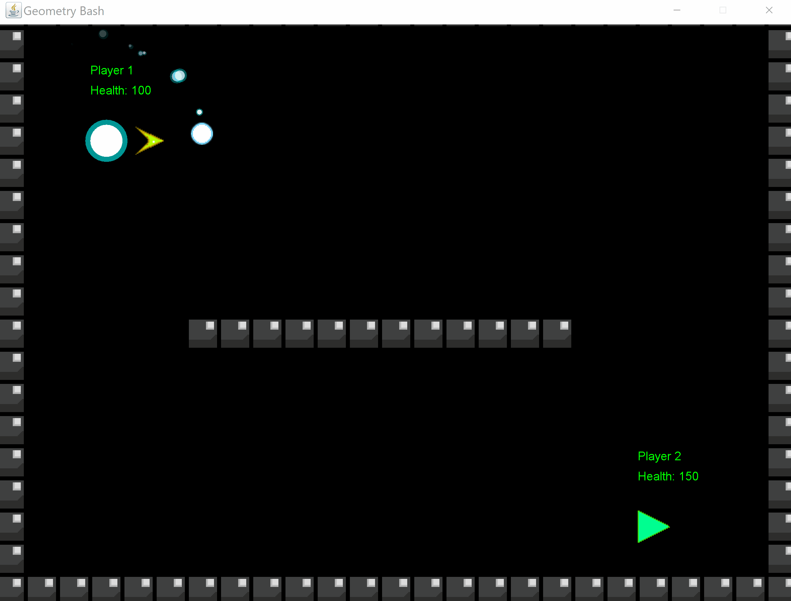

# GeometryBash
Geometry Clash, except well thought out this time. GeometryBash is a 2D fighting game created with pure java.

## Controls:

### Circle Controls:

WASD, press 4 to fire the orbiting circle in the direction of the arrow.

### Triangle Controls:

LRUD, press O (not zero) to fire in the direction the triangle is facing.

## Sample Gameplay:

